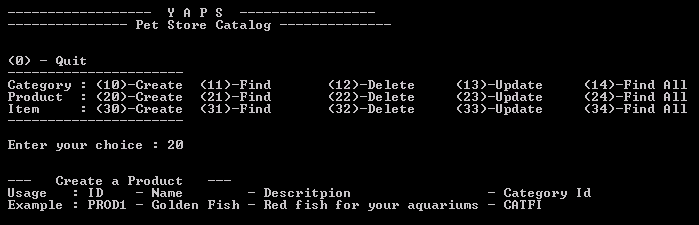
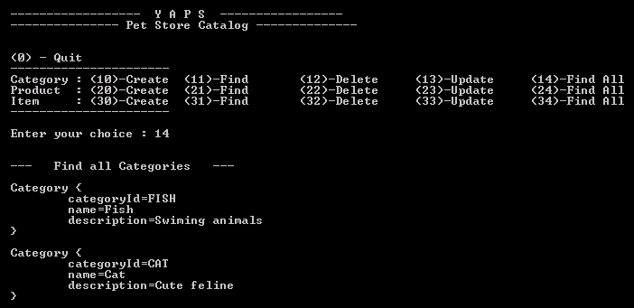
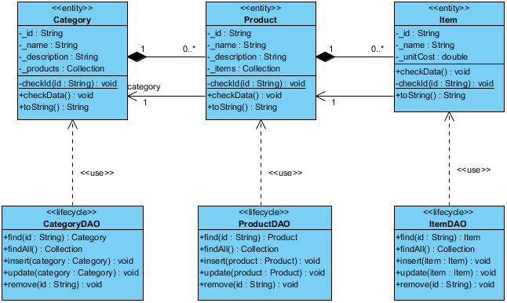

# Persistance des objets
L'un des fondements de la programmation Orientée Objet réside dans l'idée de réutilisation. La plate-forme Java collecte pour sa part les objets en mémoire afin qu'ils puissent être accédés à partir de n'importe quelle application Java. Cependant, cette ré-utilisabilité n'est valable que tant que la Java Virtual Machine (JVM) est lancée : si celle-ci est arrêtée, le contenu de la mémoire disparaît.

C'est ici que la _sérialisation_ intervient : elle permet de stocker l'état des objets, ainsi que la manière de les recréer pour plus tard. Un objet peut ainsi exister entre deux exécutions d'un programme, ou entre deux programmes : c'est la persistance objet. La persistance est ainsi le fait « d'exister dans le temps ». Un objet qui reste en l'état lorsqu'il est sauvegardé puis chargé par une autre application, ou à un moment éloigné, possède la propriété de persistance. En conséquence, l'objet n'est plus dépendant de l'application qui l'a créé.

Les objets peuvent être sérialisés sur le disque dur interne, ou sur le réseau disponible (Internet compris). Pour rendre un objet persistant, il faut le sérialiser en implémentant l'interface java.io.Serializable au sein de la classe : Java saura alors comment utiliser l'objet.

Au travers de ce mécanisme de sérialisation, Java fournit une méthode facile, transparente et standard de réaliser cette opération : cela permet facilement de mettre en place un mécanisme de persistance. Il est de ce fait inutile de créer un format particulier pour sauvegarder et relire un objet. Le format utilisé est indépendant du système d'exploitation. Ainsi, un objet sérialisé sur un système peut être réutilisé par un autre système pour récréer l'objet.

Java introduit le mot-clé transient qui précise que l'attribut qu'il qualifie ne doit pas être inclus dans un processus de sérialisation et donc de dé-sérialisation.


# TP02
Modifié par Pascal Fares (Cnam Liban) Janvier 2020
Origine : http://aisl.cnam.fr/xwiki/wiki/aisl/view/GLG203/TP02

## Hello PetStore !

Cet exemple vous montre comment sérialiser et désérialiser des objets liés entre eux. Ici, la classe Hello est liée à la classe Petstore.

Si vous passez le paramètre « ecrire » à ce programme (1) la méthode privée ecrire() est appelée (2). Cette méthode instancie un objet Hello et un objet Petstore (3) qu'elle sérialise dans un fichier appelé hellopetstore.ser. Appelez cette même classe avec le paramètre « lire » et le contenu du fichier sera lu (5), les instances des deux objets recréées (6) et leur contenu affiché (7).

```java
public class Main {
    // Point d'entrée de l'application
    public static void main(String[] args) {
        if (args[0].equals("ecrire")) { (1)
            ecrire();
        } else {
            lire();
        }
    }
    private static void ecrire() { (2)
        // Crée une instance de chaque objet et les lie entre eux
        Hello hello = new Hello("Hello ");
        Petstore petstore = new Petstore("PetStore!", new Date()); (3)
        hello.setPetstore(petstore);
        try {
            final FileOutputStream fout = new FileOutputStream("hellopetstore.ser");
            final ObjectOutputStream out = new ObjectOutputStream(fout);
            // Serialise l'objet hello qui est lié à l'objet petstore
            out.writeObject(hello); (4)
            out.close();
        } catch (Exception e) {
            e.printStackTrace();
        }
    }
    private static void lire() {
        try {
            final FileInputStream fin = new FileInputStream("hellopetstore.ser");
            final ObjectInputStream in = new ObjectInputStream(fin); (5)
            // Déserialise l'objet hello
            Hello hello = (Hello) in.readObject(); (6)
            in.close();
            // En affichant ses attributs, le contenu de l'objet
            // petstore est aussi affiché
            System.out.println(hello); (7)
        } catch (Exception e) {
            e.printStackTrace();
        }
    }
}
```


La classe Hello :

```java
import java.io.Serializable;
public class Hello implements Serializable {
    private String valeur;
    private Petstore petstore; (3)
    // Constructeur
    public Hello(String valeur) {
        this.valeur = valeur;
    }
    public void setPetstore(Petstore petstore) {
        this.petstore = petstore;
    }
    // Cette méhode retourne le contenu de la classe Hello
    // concatené avec le contenu de la classe Petstore
    public String toString() {
        return valeur + petstore;
    }
}
```

La classe Petstore :

```java
import java.io.Serializable;
import java.util.Date;
public class Petstore implements Serializable {
    private String valeur;
    private Date date;
    // Constructeur
    public Petstore(String valeur, Date date) {
        this.valeur = valeur;
        this.date = date;
    }
    // Cette méhode retourne le contenu de la classe Petstore
    public String toString() {
        return valeur + "\n" + date;
    }
}
```

Après compilation de cette classe, exécutez-la une première fois avec le paramètre « ecrire ». Vous verrez la présence du fichier hellopetstore.ser sur votre disque. Ce fichier contient les objets Hello et Petstore. Ensuite, ré-exécutez la avec le paramètre « lire », vous devriez voir la chaîne de caractère Hello PetStore !!! et une date affichée à l'écran.

## Outils

Pour automatiser les traitements répétitifs en mode batch (suppression de fichiers, compilation, compression de fichiers...) nous utiliserons Gradle ou Ant ou Maven. Ces outils simple d'utilisation, bâti sur des technologies ouvertes (Java ou Grouvy et XML), extensible, et supporté par de nombreux logiciels.

Nous supposons que grace aux TP00 et TP01 vous savez utiliser Maven ou Gradle

# Expression des besoins

La société YAPS est satisfaite du logiciel de gestion des clients Petstore Customer. Elle voudrait maintenant informatiser la gestion de son catalogue d'animaux de compagnie. Le catalogue est divisé en catégories. Pour l'instant YAPS ne gère que cinq catégories d'animaux, bien qu'elle envisage d'étendre sa gamme :

*   Poissons
*   Chiens
*   Chats
*   Reptiles
*   Oiseaux

Chaque catégorie est sub-divisée en produit. Par exemple pour les chiens, on peut avoir les produits suivants :

*   Bulldog
*   Caniche
*   Dalmatien
*   Labrador
*   Lévrier

Puis enfin chaque produit est, à son tour, divisé en article. Ce sont ces articles qui sont proposés et vendus aux clients. Par exemple, le produit Caniche regroupe les articles finaux suivants :

*   Caniche femelle adulte
*   Caniche mâle adulte
*   Caniche femelle 3 mois
*   Caniche mâle 3 mois

Cette gestion du catalogue sera effectuée par John. L'application sera uniquement déployée sur son poste et ressemblera à celle de Bill. Elle se nomme Petstore Catalog.

## Vue Utilisateur

### Diagramme de cas d'utilisation


Figure 1 - Diagramme de cas d'utilisation de la gestion du catalogue

Vous remarquerez que la granularité des cas d'utilisation est différente de celle de la première version de l'application. Si YAPS avait utilisé la même granularité pour décrire ses use cases, nous aurions les cas d'utilisations suivants : Créer une catégorie, supprimer une catégorie, mettre à jour une catégorie, rechercher une catégorie, créer un produit, supprimer un produit… Pour des cas d'utilisation simples, il est possible de les regrouper dans un seul. Notez aussi la présence des relations <<include>> entre cas d'utilisation. Cela signifie que pour gérer le catalogue il faut au moins une fois gérer les catégories, les produits et les articles.</include>

### Cas d'utilisation « Gérer les catégories »

Nom: Gérer les catégories.</th>

Résumé: Permet à John de créer/modifier/supprimer/lister les catégories du catalogue.

Acteurs: John.

Pré-conditions: Aucune

Description: YAPS veut saisir les catégories de son catalogue et les persister. Elle pourra ensuite, si elle le désire, en modifier le contenu, supprimer certaines catégories, en afficher une ou la liste entière. Une catégorie contient les données suivantes :  
- Category Id : identifiant unique de la catégorie ((1))((2)). Cet identifiant est construit manuellement par YAPS.  
- Name : nom de la catégorie (ex. Poisson, Chien, Chat...)  
- Description de la catégorie : (ex. Un chien est un animal affectueux qui partagera avec vous des moments de bonheur)  
Une catégorie possède aussi une liste de produits.  
Les champs Category Id, Name et Description sont obligatoires ((3)).

Exceptions: ((1)) Si l'identifiant saisi existe déjà dans le système, une exception DuplicateKeyException est levée.  
((2)) Lors d'une recherche, si l'identifiant n'est pas présent dans le système une exception ObjectNotFoundException est levée.  
Si une erreur système se produit durant la création d'une catégorie, l'exception CreateException doit être levée.  
Si une erreur système se produit durant la mise à jour d'une catégorie, l'exception UpdateException doit être levée.  
Si une erreur système se produit durant la suppression d'une catégorie, l'exception RemoveException doit être levée.  
Si une erreur système se produit durant la recherche d'une catégorie, l'exception FinderException doit être levée.  
((3)) Une exception est levée si l'un des champs est manquant.

Post-conditions: Une catégorie est créée/modifiée/supprimée/listée.


### Cas d'utilisation « Gérer les produits »

Nom: Gérer les produits.</th>

Résumé: Permet à John de créer/modifier/supprimer/lister les produits du catalogue.

Acteurs: John.

Pré-conditions: Pour la création/modification d'un produit, la catégorie à laquelle se rapporte le produit doit exister dans le système.

Description: YAPS veut saisir les produits de son catalogue, les rattacher à une catégorie et les persister. Elle pourra ensuite, si elle le désire, en modifier le contenu, supprimer certains produits, en afficher un ou la liste entière. Un produit contient les données suivantes :  
- Product Id : identifiant unique du produit ((1))((2)). Cet identifiant est construit manuellement par YAPS.  
- Name : nom du produit (ex. Bulldog, Caniche, Dalmatien...)  
- Description du produit : (ex. Un caniche est un petit chien affectueux qui ne prendra pas trop de place et saura vous réconforter de sa tendresse)  
Un produit contient une liste d'article.  
Lorsqu'on affiche les données d'un produit, on veut aussi visualiser l'identifiant et le nom de la catégorie à laquelle se rattache le produit.  
Les champs Product Id, Name et Description sont obligatoires ((3)).

Exceptions: ((1)) Si l'identifiant saisi existe déjà dans le système, une exception DuplicateKeyException est levée.  
((2)) Lors d'une recherche, si l'identifiant n'est pas présent dans le système une exception ObjectNotFoundException est levée.  
Si une erreur système se produit durant la création d'un produit, l'exception CreateException doit être levée.  
Si une erreur système se produit durant la mise à jour d'un produit, l'exception UpdateException doit être levée.  
Si une erreur système se produit durant la suppression d'un produit, l'exception RemoveException doit être levée.  
Si une erreur système se produit durant la recherche d'un produit, l'exception FinderException doit être levée.  
((3)) Une exception est levée si l'un des champs est manquant.

Post-conditions: Un produit est créé/modifié/supprimé/listé.


### Cas d'utilisation « Gérer les articles »

Nom: Gérer les articles.</th>

Résumé: Permet à John de créer/modifier/supprimer/lister les articles du catalogue.

Acteurs: John.

Pré-conditions: Pour la création/modification d'un article, le produit auquel se rapporte l'article doit exister dans le système.

Description: YAPS veut saisir les articles de son catalogue, les rattacher à un produit et les persister. Elle pourra ensuite, si elle le désire, en modifier le contenu, supprimer certains articles, en afficher un ou la liste entière. Un article contient les données suivantes :  
- Item Id : identifiant unique de l'article ((1))((2)). Cet identifiant est construit manuellement par YAPS.  
- Name : nom de l'article (ex. Caniche 3 mois femelle...)  
- Unit Cost : prix unitaire de l'article  
Lorsqu'on affiche les données d'un article, on veut aussi visualiser l'identifiant et le nom du produit auquel se rattache l'article.  
Les champs Item Id, Name et UnitCost sont obligatoires ((3)).

Exceptions: ((1)) Si l'identifiant saisi existe déjà dans le système, une exception DuplicateKeyException est levée.  
((2)) Lors d'une recherche, si l'identifiant n'est pas présent dans le système une exception ObjectNotFoundException est levée.  
Si une erreur système se produit durant la création d'un article, l'exception CreateException doit être levée.  
Si une erreur système se produit durant la mise à jour d'un article, l'exception UpdateException doit être levée.  
Si une erreur système se produit durant la suppression d'un article, l'exception RemoveException doit être levée.  
Si une erreur système se produit durant la recherche d'un article, l'exception FinderException doit être levée.  
((3)) Une exception est levée si l'un des champs est manquant.

Post-conditions: Un article est créé/modifié/supprimé/listé.


## Écrans

John veut utiliser le même genre d'interface graphique que Bill. L'application « Gestion du catalogue » se présentera donc de la manière suivante :



Les actions sont identiques à l'application de Bill, cependant il existe 3 menus supplémentaires : la possibilité d'obtenir la liste complète des catégories, des produits et des articles. Ainsi en choisissant le menu 14, le résultat obtenu est le suivant :



Lors de la consultation d'un produit, l'application affichera l'identifiant et le nom de la catégorie auquel il est rattaché.

# Analyse et conception

## Vue logique

Avertissement: L'application précédente possédait des exceptions fortement typées utilisables uniquement par la classe Customer telles que CustomerCreateException, CustomerUpdateException, CustomerFinderException… Si nous utilisons la même approche pour les classes Category, Product et Item nous obtiendrons trois fois plus d'exceptions. On peut tout simplement rendre ces exceptions plus génériques telles que ObjectNotFoundException, DuplicateKeyException, CreateException, UpdateException… en les renommant. La classe abstraite CustomerException peut être renommée en ApplicationException.

Les objets métiers constituant le catalogue de YAPS sont les catégories (Category), les produits (Product) et les articles (Item). Ils sont liés entre eux par des liens de composition.

Il existe trois types de relations entre classes :

*   **Association** : Relation sémantique entre deux ou plusieurs classes. C'est une connexion, bidirectionnelle par défaut, entre leurs instances. Sous-type de Relation représentée par une ligne.
*   **Agrégation** : Une forme spéciale d'association qui spécifie une relation tout-partie entre l'agrégat (le tout) et une partie. Elle est représentée par une ligne avec un losange vide à une extrémité.
*   **Composition** : Une forme d'agrégation qui exprime une forte propriété entre le tout et les parties, ainsi qu'une subordination entre l'existence des parties et du tout. Les parties, dont la multiplicité est non figée, peuvent être créées après le composite lui-même, mais une fois créées, elles vivent et meurent avec lui (c'est à dire qu'elles partagent sa durée de vie). De telles parties peuvent également être explicitement retirées avant la mort du composite. La composition peut être récursive. Représenté par une ligne avec un losange plein (noir) à une extrémité.


  



Figure 2 - Diagramme de classes du catalogue  
Vous pouvez interpréter le diagramme ci-dessus de la manière suivante. Une catégorie peut avoir zéro ou plusieurs produits, et un produit peut avoir zéro ou plusieurs articles. Les relations de composition nous indiquent que la suppression d'une catégorie entraînera la suppression de ses produits liés. Les relations étant bidirectionnelles, un article connait son produit et ce dernier connait sa catégorie.  

Tout comme la classe CustomerDAO, les classes CategoryDAO, ProductDAO et ItemDAO utilisent toutes la classe Hashmap pour persister les objets métiers et implémenter les opérations CRUD (Create, Read, Update, Delete). Ces DAO possèdent une nouvelle méthode : findAll. Celle-ci retourne la totalité des objets de même type. Par exemple, CategoryDAO.findAll()renvoie une collection contenant la totalité des catégories du système. Par souci de réutilisation, ces classes héritent de la classe DataAccessObject qui factorise les méthodes et les attributs communs (notamment l'instance de HashMap).  

Ci-dessous un diagramme objet vous permettra de vous rendre compte concrètement de ces relations.  

 et des liens (relations sémantiques) entre ces objets. Il donne une image statique et non exhaustive de ces instances.

#### Le nouveau for en java 1.5

Il permet une écriture simplifiée et plus lisible  
Avant Java 1.5

<div class="code">

<pre><span class="java-keyword">final Collection categories;
categories = <span class="java-keyword">new Category().findAll();
<span class="java-keyword">for (Iterator iterator = categories.iterator(); iterator.hasNext();) {
  <span class="java-keyword">final Category category = (Category) iterator.next();
  <span class="java-object">System.out.println("\n" + category);
}</pre>


Depuis Java 1.5

<div class="code">

<pre><span class="java-keyword">final Collection<Category> categories;
categories = <span class="java-keyword">new Category().findAll();
<span class="java-keyword">for (Category category : categories) {
 <span class="java-object">System.out.println("\n" + category);
}</pre>


## Vue Processus

Il y a maintenant deux utilisateurs : Bill et John. Ils utilisent deux applications totalement différentes : Bill, la gestion clientèle, et John, la gestion du catalogue. La classe Menu de l'application précédente est renommée en MenuCustomer. La nouvelle classe d'interface graphique destinée à gérer le catalogue se nomme MenuCatalog.

La classe HashMap est maintenant utilisée par plusieurs classes de type DAO qui rendent persistantes les objets dans différents fichiers, selon leur type. Par exemple, les objets Customer seront persistés dans le fichier persistentCustomer.ser, Product dans persistentProduct.ser, Item dans persistentItem.ser et Category dans persitentCategory.ser...

 : Un paquetage possède trop de classes => créer de nouveaux paquetages.
*   **Déplacer Classe** (Move Class) : Une classe se trouve dans un paquetage avec d'autres classes qui ne lui correspondent pas => déplacer la classe vers un autre paquetage.


La répartition des classes par paquetages est donc la suivante :

![Repertoires.PNG](images/Repertoires.PNG "Repertoires.PNG"

Au même niveau que les répertoires %YAPS_PETSTORE%/src et %YAPS_PETSTORE%/classes, on rajoute dans le répertoire %YAPS_PETSTORE% le fichier build.xml utilisé par Ant. Ce fichier contient notamment les cibles : yaps-clean permettant de supprimer les répertoires de compilation, yaps-compile qui permet de compiler les classes java et les classes de test, yaps-build qui crée les deux fichiers jar à déployer, et yaps-test qui exécute les classes de test.

## Vue déploiement

L'application PetStore Customer est déployée sur le PC de Bill alors que PetStore Catalog est déployée sur le poste de John. Elles se trouvent respectivement dans les fichiers clientCustomer.jar et clientCatalog.jar sous le répertoire temporaire %YAPS_PETSTORE%/build. Pour faciliter la tâche des utilisateurs Bill et John, un simple clic sur un fichier .bat permettra de lancer les applications.

 qui peuvent être liés entre eux à l'aide d'un support de communication.

# Implémentation

Vous pouvez maintenant développer l'application à partir de la version précédente, ou télécharger la liste des classes fournie pour commencer votre développement. Dans ces documents fournis, il manque les nouvelles classes du domaine, c'est-à-dire Category, Product et Item. Il y a aussi le script Ant (%YAPS_PETSTORE%/build.xml) qui permet de faciliter la compilation de l'application et de la déployer dans des fichiers jar.

Avertissement: Attention, rappelez-vous qu'un produit n'est valide que si sa catégorie l'est aussi. De la même manière, un article n'est correct que si son produit est valide.

# Recette utilisateur

Téléchargez les classes de test représentant la recette utilisateur. Cette application étant plus riche, il y a plus de tests à faire passer. La classe AllTests appelle les autres classes, c'est-à-dire CustomerTest, CustomerDAOTest, CategoryDAOTest, ProductDAOTest et ItemDAOTest.

# Résumé

Avec l'application Petstore Catalog, le nombre de classes métier augmenté. Les technologies utilisées sont les mêmes que celles du Petstore Customer : les interfaces utilisateur sont simples à développer et simples à manipuler, les objets du catalogue sont sérialisés sur disque et les deux applications sont déployées sur deux postes utilisateurs sous forme de fichier .jar.

La sérialisation vous permet de persister les objets sans aucun effort. Java possède cette habilité de transformer la représentation mémoire d'une grappe d'objet en un flux binaire et de le stocker sur disque. La persistance des objets est un problème complexe qu'on ne peut résoudre qu'avec des outils annexes et souvent complexe ou gourmand en ressources (base de données objets ou relationnel, serveur LDAP...). La sérialisation est la technologie la plus simple pour persister les objets et, est fournie en standard avec le langage java. La sérialisation est idéale pour des applications de très petite taille qui ne nécessitent pas de requête d'accès aux données trop complexes.  

# Recommandations

*   Ce TP est plus long que le précédent. Prévoir entre 2 et 6 heures.

<span style="color:#990033; background-color:#ffffff; ">(**_Attention:_** cela ne veut pas dire que vous pouvez le commencer Mardi à 18h en étant assurés de l'avoir terminé pour Mercredi à 23h! Ne tombez pas dans le panneau! Commencez vos TPs le Vendredi soir ou le Samedi au plus tard pour éviter les surprises).

# Références

Discover the secrets of the Java Serialization API <span class="nobr">[http://java.sun.com/developer/technicalArticles/Programming/serialization/](http://java.sun.com/developer/technicalArticles/Programming/serialization/)

Implement Persistent Objects with Java Serialization <span class="nobr">[http://www.devx.com/Java/Article/9931](http://www.devx.com/Java/Article/9931)

Ant <span class="nobr">[http://ant.apache.org/](http://ant.apache.org/)

Ant: The Definitive Guide Jesse Tilly, Eric M. Burke. O'Reilly. 2002.

Java Development With Ant Erik Hatcher, Steve Loughran. Manning Publications. 2002.

What is the difference between composition and aggregation? <span class="nobr">[http://www.jguru.com/faq/view.jsp?EID=51520](http://www.jguru.com/faq/view.jsp?EID=51520)

Object Diagrams in UML <span class="nobr">[http://www.developer.com/design/article.php/2223551](http://www.developer.com/design/article.php/2223551)

Refactoring : Extract Package <span class="nobr">[http://www.refactoring.com/catalog/extractPackage.html](http://www.refactoring.com/catalog/extractPackage.html)

Refactoring : Move Class <span class="nobr">[http://www.refactoring.com/catalog/moveClass.html](http://www.refactoring.com/catalog/moveClass.html)

Deployment Diagram in UML <span class="nobr">[http://www.developer.com/design/article.php/3291941](http://www.developer.com/design/article.php/3291941)

Refactoring ? Improving the Design of Existing Code Martin Fowler, Kent Beck, John Brant, William Opdyke, Don Roberts. Addison-Wesley. 1999.


<div id="xdocFooter">

<div class="doc-tags" id="xdocTags">Tags:

<div id="xdocAuthors">

<div class="xdocCreation">Créé par <span class="wikilink">[Pascal GRAFFION](/xwiki/wiki/aisl/view/XWiki/graffiop) le 2007/10/08 13:24  


<div id="xwikidata" class="layoutsubsection">

<div id="docextraanchors" class="invisible"><span id="Commentsanchor"> <span id="Annotationsanchor"> <span id="Attachmentsanchor"> <span id="Historyanchor"> <span id="Informationanchor"> 

<div id="xwikidatacontents">

<div class="floatcontainer" id="docExtraTabs">

*   [Commentaires <span class="itemCount">(0)](/xwiki/wiki/aisl/view/GLG203/TP02?viewer=comments)
*   [Annotations <span class="itemCount">(0)](/xwiki/wiki/aisl/view/GLG203/TP02?viewer=annotations)
*   [Pièces Jointes <span class="itemCount">(9)](/xwiki/wiki/aisl/view/GLG203/TP02?viewer=attachments)
*   [Historique](/xwiki/wiki/aisl/view/GLG203/TP02?viewer=history)
*   [Pages liées](/xwiki/wiki/aisl/view/GLG203/TP02?viewer=information)


<script type="text/javascript">var hashviewer = self.document.location.hash.substring(1); var extraInit = function(){ XWiki.displayDocExtra("Comments", "commentsinline.vm", false) }; if (hashviewer == "Comments") { var extraInit = function(){ XWiki.displayDocExtra("Comments", "commentsinline.vm", true) }; } if ($("Commentslink") != null) { $("Commentslink").href="#Comments"; Event.observe($("Commentslink"), "click", function(){ XWiki.displayDocExtra("Comments", "commentsinline.vm", false); }, false); } if ($("tmShowComments") != null) { $("tmShowComments").href="#Comments"; Event.observe($("tmShowComments"), "click", function(){ XWiki.displayDocExtra("Comments", "commentsinline.vm", true); }, false); } if ($("commentsshortcut") != null) { $("commentsshortcut").down('a').href="#comments"; Event.observe($("commentsshortcut"), "click", function(){ XWiki.displayDocExtra("Comments", "commentsinline.vm", true); }, false); } if (hashviewer == "Annotations") { var extraInit = function(){ XWiki.displayDocExtra("Annotations", "annotationsinline.vm", true) }; } if ($("Annotationslink") != null) { $("Annotationslink").href="#Annotations"; Event.observe($("Annotationslink"), "click", function(){ XWiki.displayDocExtra("Annotations", "annotationsinline.vm", false); }, false); } if ($("tmShowAnnotations") != null) { $("tmShowAnnotations").href="#Annotations"; Event.observe($("tmShowAnnotations"), "click", function(){ XWiki.displayDocExtra("Annotations", "annotationsinline.vm", true); }, false); } if ($("annotationsshortcut") != null) { $("annotationsshortcut").down('a').href="#annotations"; Event.observe($("annotationsshortcut"), "click", function(){ XWiki.displayDocExtra("Annotations", "annotationsinline.vm", true); }, false); } if (hashviewer == "Attachments") { var extraInit = function(){ XWiki.displayDocExtra("Attachments", "attachmentsinline.vm", true) }; } if ($("Attachmentslink") != null) { $("Attachmentslink").href="#Attachments"; Event.observe($("Attachmentslink"), "click", function(){ XWiki.displayDocExtra("Attachments", "attachmentsinline.vm", false); }, false); } if ($("tmShowAttachments") != null) { $("tmShowAttachments").href="#Attachments"; Event.observe($("tmShowAttachments"), "click", function(){ XWiki.displayDocExtra("Attachments", "attachmentsinline.vm", true); }, false); } if ($("attachmentsshortcut") != null) { $("attachmentsshortcut").down('a').href="#attachments"; Event.observe($("attachmentsshortcut"), "click", function(){ XWiki.displayDocExtra("Attachments", "attachmentsinline.vm", true); }, false); } if (hashviewer == "History") { var extraInit = function(){ XWiki.displayDocExtra("History", "historyinline.vm", true) }; } if ($("Historylink") != null) { $("Historylink").href="#History"; Event.observe($("Historylink"), "click", function(){ XWiki.displayDocExtra("History", "historyinline.vm", false); }, false); } if ($("tmShowHistory") != null) { $("tmShowHistory").href="#History"; Event.observe($("tmShowHistory"), "click", function(){ XWiki.displayDocExtra("History", "historyinline.vm", true); }, false); } if ($("historyshortcut") != null) { $("historyshortcut").down('a').href="#history"; Event.observe($("historyshortcut"), "click", function(){ XWiki.displayDocExtra("History", "historyinline.vm", true); }, false); } if (hashviewer == "Information") { var extraInit = function(){ XWiki.displayDocExtra("Information", "informationinline.vm", true) }; } if ($("Informationlink") != null) { $("Informationlink").href="#Information"; Event.observe($("Informationlink"), "click", function(){ XWiki.displayDocExtra("Information", "informationinline.vm", false); }, false); } if ($("tmShowInformation") != null) { $("tmShowInformation").href="#Information"; Event.observe($("tmShowInformation"), "click", function(){ XWiki.displayDocExtra("Information", "informationinline.vm", true); }, false); } if ($("informationshortcut") != null) { $("informationshortcut").down('a').href="#information"; Event.observe($("informationshortcut"), "click", function(){ XWiki.displayDocExtra("Information", "informationinline.vm", true); }, false); } document.observe("dom:loaded", extraInit, false);</script>


<div id="rightPanels" class="panels right panel-width-Medium">

<div class="panel expanded SpaceDocs">

# GLG203

<div class="xwikipanelcontents">

*   <span class="wikilink">[Agenda](/xwiki/wiki/aisl/view/GLG203/Agenda)
*   <span class="wikilink">[Enseignement](/xwiki/wiki/aisl/view/GLG203/Enseignement)
*   <span class="wikilink">[TP01](/xwiki/wiki/aisl/view/GLG203/TP01)
*   <span class="wikilink">[TP02](/xwiki/wiki/aisl/view/GLG203/TP02)
*   <span class="wikilink">[TP03](/xwiki/wiki/aisl/view/GLG203/TP03)
*   <span class="wikilink">[TP04](/xwiki/wiki/aisl/view/GLG203/TP04)
*   <span class="wikilink">[TP05](/xwiki/wiki/aisl/view/GLG203/TP05)
*   <span class="wikilink">[TP05_SP](/xwiki/wiki/aisl/view/GLG203/TP05_SP)
*   <span class="wikilink">[TP06](/xwiki/wiki/aisl/view/GLG203/TP06)
*   <span class="wikilink">[TP06_SP](/xwiki/wiki/aisl/view/GLG203/TP06_SP)
*   <span class="wikilink">[TP07](/xwiki/wiki/aisl/view/GLG203/TP07)
*   <span class="wikilink">[TP07_SP](/xwiki/wiki/aisl/view/GLG203/TP07_SP)
*   <span class="wikilink">[TP08](/xwiki/wiki/aisl/view/GLG203/TP08)
*   <span class="wikilink">[TP08_SP](/xwiki/wiki/aisl/view/GLG203/TP08_SP)
*   <span class="wikilink">[TP09](/xwiki/wiki/aisl/view/GLG203/TP09)
*   <span class="wikilink">[TP09_SP](/xwiki/wiki/aisl/view/GLG203/TP09_SP)
*   <span class="wikilink">[TP10](/xwiki/wiki/aisl/view/GLG203/TP10)
*   <span class="wikilink">[TP10_SP](/xwiki/wiki/aisl/view/GLG203/TP10_SP)
*   <span class="wikilink">[TP11_EJB3_GlassFish](/xwiki/wiki/aisl/view/GLG203/TP11_EJB3_GlassFish)
*   <span class="wikilink">[TP11_SP](/xwiki/wiki/aisl/view/GLG203/TP11_SP)
*   <span class="wikilink">[TP12_JPA_GlassFish](/xwiki/wiki/aisl/view/GLG203/TP12_JPA_GlassFish)
*   <span class="wikilink">[TP12_SP](/xwiki/wiki/aisl/view/GLG203/TP12_SP)
*   <span class="wikilink">[WebHome](/xwiki/wiki/aisl/view/GLG203/)
*   <span class="wikilink">[WebPreferences](/xwiki/wiki/aisl/view/GLG203/WebPreferences)
*   <span class="wikilink">[WikiTests](/xwiki/wiki/aisl/view/GLG203/WikiTests)


<div class="panel expanded MyRecentModifications">

# Mes pages éditées

<div class="xwikipanelcontents">

*   [$escapetool.xml($recentDoc.plainTitle)]($recentDoc.getURL())


<div id="footerglobal" class="layoutsection">

* * *

<div id="xwikilicence">This wiki is licensed under a [Creative Commons 2.0](http://creativecommons.org/licenses/by/2.0/) license

<div id="xwikiplatformversion">XWiki Enterprise 7.1.1 - [Documentation](http://www.xwiki.org/xwiki/bin/view/Main/Documentation

* * *


