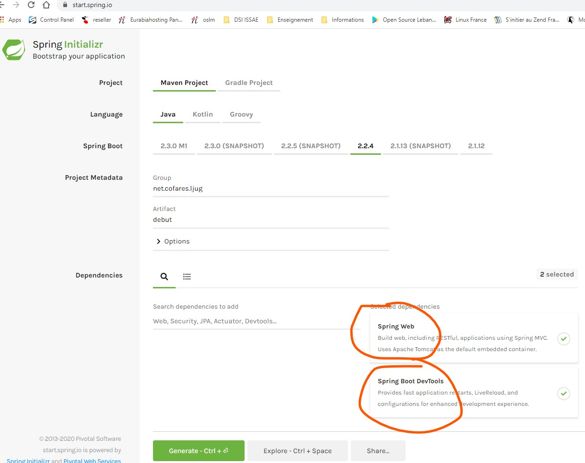
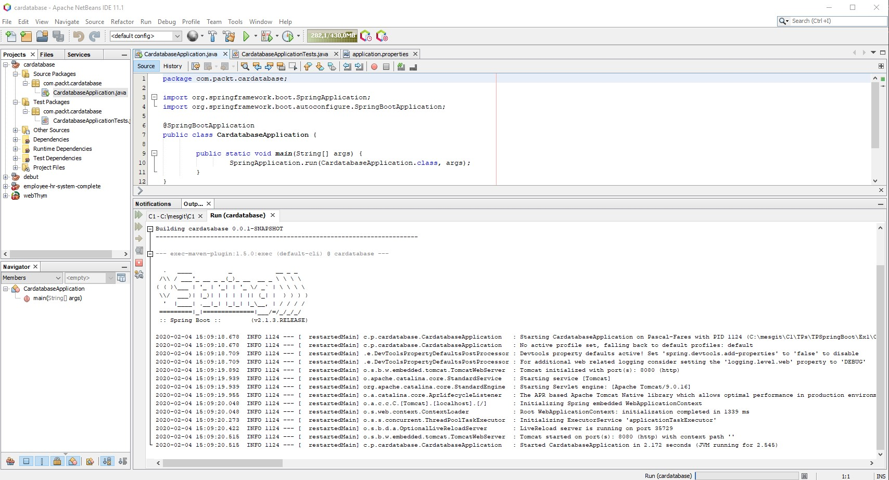
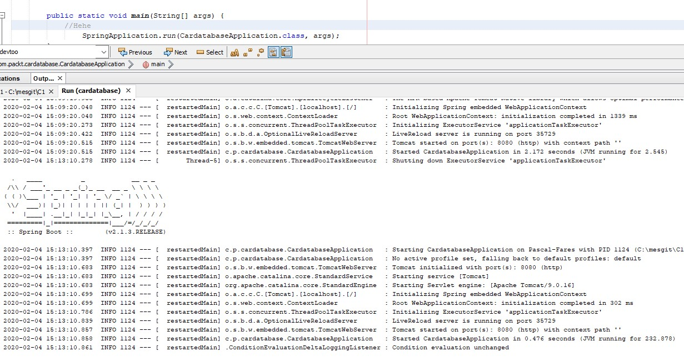

# Les Bases de SpringBoot

## Installer un atelier netbeans 11.2, Eclipse, ou itellij acceptant Maven

## Installer maven

## Création d'un projet avec start.spring.io



1. Récuperer le .zip
2. L'ouvrir dans un atelier
3. Aller voir le fichier .java
4. Faire run




# l'utilisation de devtools
Les outils de développement Spring Boot simplifient le processus de développement d'applications. Les projets incluront les outils de développement si la dépendance suivante est ajoutée au fichier Maven pom.xml:
```xml
<dependency>
    <groupId>org.springframework.boot</groupId>
    <artifactId>spring-boot-devtools</artifactId>            <scope>runtime</scope>
</dependency>
```

Si vous modifier le code => redéploiment automatique [Réactivité par rapport aux codes modifiés]




## Les logs et résolution de problèmes


Vous pouvez configurer le niveau de journalisation dans votre fichier Spring Boot `application.properties`. Le fichier se trouve dans le dossier des ressources à l'intérieur de votre projet:

Si nous définissons le niveau de journalisation sur INFO, nous pouvons voir les messages de journal des niveaux qui sont sous INFO (INFO, WARN, ERROR et FATAL). Dans l'exemple suivant, nous définissons le niveau de journalisation pour la racine, mais vous pouvez également le définir au niveau du package:

## installer Mysql !

Nous utiliserons JPA avec une base de donnée, installons Mysql

dans WSL / UBUNTU 18.04

```
sudo apt install mysql-server
```

puis demarrer

```
sudo /etc/init.d/mysql start
```

## installer mysqlworkbench


