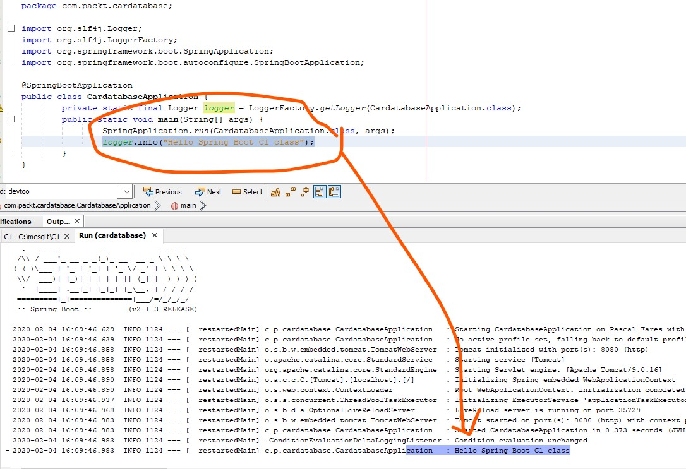

# Les Bases de SpringBoot

## Installer un atelier netbeans 11.2, Eclipse, ou Itellij acceptant Maven

## Installer maven

## Création d'un projet avec start.spring.io ou grace au plugins netbeans 11.2 par exemple

J'utiliserais par la suite netbeans 11.2


1. Récupérer le .zip (ou directement aux moyen du plugins Netbeans)
2. L'ouvrir dans un atelier
3. Aller voir le fichier .java
4. Faire run


# l'utilisation de devtools
Les outils de développement Spring Boot simplifient le processus de développement d'applications. Les projets incluront les outils de développement si la dépendance suivante est ajoutée au fichier Maven pom.xml:
```xml
<dependency>
    <groupId>org.springframework.boot</groupId>
    <artifactId>spring-boot-devtools</artifactId>            <scope>runtime</scope>
</dependency>
```

Si vous modifier le code => redéploiement automatique [Réactivité par rapport aux codes modifiés]


## Les logs et résolution de problèmes



Vous pouvez configurer le niveau de journalisation dans votre fichier Spring Boot `application.properties`. Le fichier se trouve dans le dossier des ressources à l'intérieur de votre projet:

Si nous définissons le niveau de journalisation sur INFO, nous pouvons voir les messages de journal des niveaux qui sont sous INFO (INFO, WARN, ERROR et FATAL). Dans l'exemple suivant, nous définissons le niveau de journalisation pour la racine, mais vous pouvez également le définir au niveau du package:

## le starter thymeleaf


```html
<!DOCTYPE HTML>
<html xmlns:th="http://www.thymeleaf.org">
    <head>
        <title>Hello C1 Cnam Liban</title>
        <meta charset="utf-8">
        <meta name="viewport" content="width=device-width, initial-scale=1.0">
    </head>
    <body>
        <h2 th:text="'Bonjour, '+ ${user} + '!'" />
    </body>
</html>
```


les 2 points important pour le moment dans le fichier hello.html sont:

1. `xmlns:th="http://www.thymeleaf.org"`
2. `${user}`

```java
package lb.edu.isae.webThym.controler;

import org.springframework.stereotype.Controller;
import org.springframework.ui.Model;
import org.springframework.web.bind.annotation.GetMapping;
import org.springframework.web.bind.annotation.RequestParam;

/**
 *
 * @author Pascal Fares
 */
@Controller
public class HelloControler {
    @GetMapping("/hello") #requête
    public String sayHello(@RequestParam(defaultValue = "Cnam Liban") String name, 
            Model model){
        model.addAttribute("user",name);
        return "hello"; //La référence vers le template (un squelette avec des injections qui sont des Beans Model)
    }
}    
```
# Pour les prochains travaux
## installer Mysql !

Nous utiliserons plus tard JPA avec une base de donnée, installons Mysql

dans WSL / UBUNTU 18.04

```
sudo apt install mysql-server
```

puis démarrer

```
sudo /etc/init.d/mysql start
```

## installer mysqlworkbench


