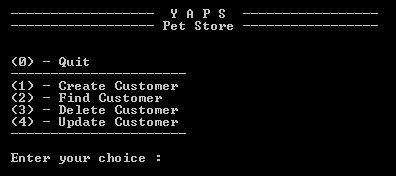
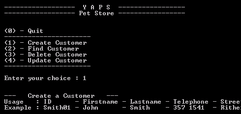
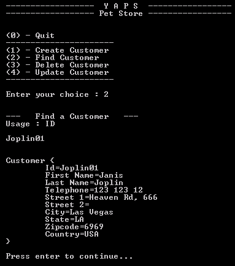
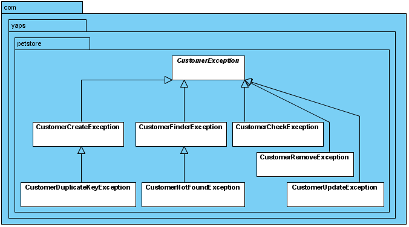
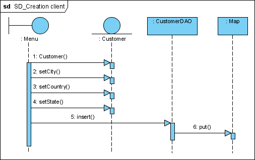
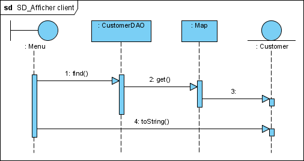
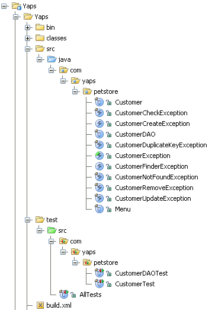

# Expression des besoins
La société américaine YAPS vend des animaux de compagnie. Elle est implantée depuis plusieurs décennies dans le sud de la Californie, où ses principaux clients sont domiciliés. Récemment elle a ouvert son marché à d'autres états américains, ainsi qu'à l'étranger. Elle continue à exercer sa profession telle qu'elle le faisait à ses débuts, c'est-à-dire qu'elle répertorie ses clients sur des fiches de papier bristol, indexées par le nom de famille, reçoit les commandes par fax et les chèques par courrier. Une fois le montant du chèque encaissé, YAPS envoie les animaux via la société de transport PetEx. Annuellement YAPS envoie son catalogue d'animaux domestiques à ses clients. Elle trouve ses nouveaux clients au travers de publicités qu'elle envoie aussi par courrier.

YAPS veut informatiser la gestion de ses clients car ils sont de plus en plus nombreux. Elle voudrait saisir leurs coordonnées et pouvoir les modifier. Cette informatisation lui permettrait surtout de pouvoir retrouver les informations de ses clients plus rapidement. YAPS possède des PC un peu obsolètes avec Windows comme système d'exploitation. Il faut donc que l'application ne consomme pas trop de ressources systèmes.

Cette tache de gestion des clients sera menée par Bill qui assure la relation clientèle. L'application devra être uniquement déployée sur le serveur d'impression. La particularité de ce serveur est qu'il est constamment allumé et n'est jamais éteint. YAPS ne possédant pas de base de données, les données peuvent être stockées en mémoire. L'application devra être simple d'utilisation et l'interface utilisateur, ainsi que la documentation et le code, devront être rédigés en anglais. Ce système de gestion clientèle se nomme PetStore Customer.

# Vue Utilisateur
## Diagramme de cas d'utilisation
Le diagramme de cas d'utilisation ci-dessous décrit les besoins utilisateurs de façon synthétique sous forme graphique. On comprend ainsi rapidement que l'utilisateur Bill veut pouvoir créer un, supprimer, modifier et rechercher un client.


### [Cas d'utilisation « Créer un client »](UC/creerClient)

### [Cas d'utilisation « Supprimer un client »](UC/suprimerClient.md)

### [Cas d'utilisation « Mettre à jour les informations d'un client »](UC/majClient.md)

### [Cas d'utilisation « Rechercher un client par son identifiant »](UC/rechercheClient.md)

# Etat actuel (Les ecrans)

## Ecrans
Bill est habitué aux écrans en mode texte et c'est ce qu'il désire utiliser pour saisir les informations des clients. Un simple menu d'accueil lui permettra de choisir l'action désirée :

* Création d'un client.
* Recherche d'un client par son identifiant.
* Suppression.
* Mise à jour des coordonnées d'un client.

On pourra ainsi accéder à l'action « création d'un client » en tapant le chiffre 1. S'affiche ensuite un menu aidant l'utilisateur à saisir les bonnes données. La ligne Usage permet à Bill de connaitre l'ordre des données à saisir et la ligne Example lui fournit un exemple.


Bill n'aura plus qu'à saisir les coordonnées d'un client en séparant chaque donnée par le caractère '-'. Le système alertera l'utilisateur du bon ou mauvais fonctionnement d'une action. Le système ne vérifiera pas la cohérence des données saisies telle que la validité du numéro de téléphone, des états ou des pays.

Pour consulter les informations d'un client, Bill saisi un identifiant et le système affiche les données.



# Analyse et conception
## Vue logique
Les cas d'utilisation nous donnent plusieurs informations sur la gestion des clients, ce qui nous permet d'extraire le diagramme de classes ci-dessous.


Figure 2 - Diagramme de classe montrant les classes Customer et CustomerDAO


La classe Customer est un POJO qui modélise un client; tous ses attributs (identifiant, nom, prénom, adresse, ...) sont de type String. Elle ne possède qu'une méthode (checkData) qui permet de vérifier la validité de ses informations.

La classe CustomerDAO permet de stocker les clients (insert), de les modifier (update), de les supprimer (remove) ou de les rechercher (find) dans un container. Pour cela, elle utilise une hashMap dont les éléments associent l'identifiant d'un client (id) à l'instance de Customer correspondante.

Cette classe CustomerDAO 'implémentes' le design pattern Data Access Object, dispensant l'objet métier Customer d'avoir à connaitre la couche d'accès aux données, le rendant ainsi plus réutilisable.
La convention de nommage des attributs utilisée dans ces exemples s'inspire du C++. Les attributs d'une classe commencent tous par un underscore '_'. Cela permet de différencier rapidement une variable ou un paramètre d'un attribut. L'autre avantage est que l'on réduit le nombre de bug d'inattention des méthodes set et que l'on n'a pas à préfixer l'attribut par this:

```java
public void setFirstname(final String firstname) {
  _firstname = firstname;
}
```

Voici la signature des méthodes de la classe CustomerDAO :

```java
Customer find(String id) throws CustomerNotFoundException;

void insert(final Customer customer) throws CustomerDuplicateKeyException, CustomerCheckException;

void update(final Customer customer) throws CustomerNotFoundException, CustomerDuplicateKeyException, CustomerCheckException;

void remove(final String id) throws CustomerNotFoundException;
```


À partir des besoins utilisateurs exprimés dans les cas d'utilisation, nous pouvons extraire les exceptions du système :

CustomerCreateException : exception levée lorsqu'une erreur se produit à la création d'un client.

CustomerDuplicateKeyException : exception levée lorsqu'on crée un nouveau client avec un identifiant existant (hérite de CustomerCreateException).

CustomerFinderException : exception levée lorsqu'une erreur se produit lors de la recherche d'un client.

CustomerNotFoundException : exception levée lorsqu'on ne trouve pas un objet qui devrait exister (hérite de CustomerFinderException).

CustomerRemoveException : exception levée lorsqu'une erreur se produit à la suppréssion d'un client.

CustomerCheckException : exception de validation levée lorsqu'une donnée obligatoire est manquante.

CustomerUpdateException : exception levée lorsqu'une erreur se produit à la mise à jour d'un client

Les exceptions sont des objets qui sont des instances de Throwable. Il existe en java deux catégories d'exceptions :
Les unchecked exceptions (exception non contrôlée) sont, en général, générées par le système. Elles correspondent à des erreurs à l'exécution et proviennent d'extension des classes Error et RuntimeException. Le compilateur java n'exige pas qu'elles soient déclarées ou traitées par les méthodes qui peuvent les lancer
Les checked exceptions (exception contrôlée) correspondent à des exceptions créées par l'utilisateur (et les méthodes des bibliothèques) elles proviennent d'extension de la classe Exception. Le compilateur exige qu'une méthode, dans laquelle une telle exception peut être levée, déclare cette exception dans son entête, ou bien la traite.

Le diagramme de classes ci-dessous représente ces classes d'exception et leurs relations.

Figure 3 - Diagramme de classes contenant les exceptions du système

CustomerException est une classe abstraite utilisée pour typer les sous-classes. Toutes les exceptions qui en dérivent sont ainsi des exceptions liées au client (Customer).


Les diagrammes de classes détaillent le contenu de chaque classe mais également les relations qui peuvent exister entre elles. Une classe est représentée par un rectangle séparé en trois parties :
la première partie contient le nom de la classe,
la seconde contient les attributs de la classe,
la dernière contient les méthodes de la classe
On peut masquer ou non une de ces parties si on veut rendre un diagramme plus lisible ou si la classe en question ne contient ni attribut ni méthode. Ces classes peuvent ensuite être liées entre elles.
Vue Processus
La classe Menu est l'interface utilisateur, c'est-à-dire le point d'entrée via lequel l'utilisateur pourra agir sur la classe métier Customer. Toutes les actions ont comme point de départ cette classe.

Par exemple, lorsque Bill veut créer un nouveau client, la classe Menu instancie (1:) un objet Customer, lui passe toutes les informations (2:, 3:, 4:) puis demande au CustomerDAO de stocker ce client (5:). Cette instance de CustomerDAO délégue son travail de rangement à une Map (6:). Celle-ci est une liste de clés/valeurs. La clé est l'identifiant du client et la valeur, l'objet lui-même.


```java
Map<String, Customer> _hashmap = new HashMap<String, Customer>();
Customer customer =_hashmap.get("1")
```



Figure 4 - Diagramme de séquence : création d'un client
Les mêmes objets sont utilisés, mais avec une séquence différente, pour afficher les informations d'un client.


Figure 5 - Diagramme de séquence : affichage des coordonnées du client

Les diagrammes de séquences permettent de représenter des collaborations entre objets selon un point de vue temporel, on y met l'accent sur la chronologie des envois de messages. L'objectif d'un diagramme de classes est de montrer la composition structurelle d'une application. La structure d'une application est dictée par la dynamique des collaborations entre classes. En langage de modélisation unifié (UML), nous représentons généralement les aspects dynamiques des collaborations entre classes à l'aide d'un diagramme de séquence.

Le diagramme de séquence de la Figure 5 nous donne l'enchaînement des méthodes permettant d'afficher les coordonnées d'un client. Notez qu'après avoir récupéré le bon objet, le Menu appelle la méthode toString(). Celle-ci affichera à l'écran les données de l'objet. La classe Menu aurait aussi pu appeler les getters (les méthodes get) de Customer pour en récupérer tous les attributs un à un et les afficher.
Vue implémentation
Pour développer cette application, un simple éditeur de texte et un JDK seront nécessaires. Cependant, il faut définir l'emplacement physique des fichiers sources et compilés. Nous partons du principe que la racine du répertoire de développement se nomme `$YAPS_PETSTORE`. Les sources java se trouvent dans le répertoire `$YAPS_PETSTORE`/src/java. Le répertoire `$YAPS_PETSTORE`/doc/api contiendra la génération de la documentation par javadoc. Les classes de tests se trouvent sous le répertoire `$YAPS_PETSTORE`/test/src. Les scripts pour lancer l'application se trouvent dans `$YAPS_PETSTORE`/bin.

Les classes de l'application se trouvent toutes dans le paquetage com.yaps.petstore. Cette règle de nommage nous indique que PetStore est une application commerciale (com), que le nom de la société est yaps et que l'application s'intitule petstore.


Figure 6 - Structure des répertoires

Implémentation
La classe Menu est l'interface que l'utilisateur Bill utilisera pour interagir avec le système. Elle est le point d'entrée de l'application, elle contient donc une méthode public static void main(final String args).

Vous pouvez maintenant développer l'application après avoir téléchargé les classes fournies. Cette liste comporte l'exemple « Hello Petstore ! » ainsi que les classes CustomerDAO et Menu. Il vous reste à développer les classes d'exceptions et la classe Customer.

Recette utilisateur
Téléchargez les classes de test représentant la recette utilisateur. La classe AllTests appelle les autres classes, en l'occurrence dans notre cas, ce seront les classes CustomerTest et CustomerDAOTest. Une fois que tous les tests auront été exécutés avec succès, vous saurez que votre application répond aux besoins utilisateurs.

La classe de test CustomerDAOTest permet de vérifier que l'application répond bien aux demandes utilisateur. Cette classe possède plusieurs méthodes de test. Par exemple, ci-dessous la méthode testCreateCustomer s'assure que la création d'un client fonctionne. Pour cela cette méthode récupère un identifiant unique (1) et s'assure que la recherche d'un client possédant cet identifiant échoue (2). Ensuite elle crée un client avec cet identifiant unique (3), s'assure qu'elle peut le retrouver (4) et que c'est bien le même (5). Cette méthode recrée un nouveau client avec le même identifiant et s'assure que le système renvoie bien une exception (6). Enfin, elle supprime le client (7) et vérifie qu'il n'existe plus dans le système (8).


```java
public void testCreateCustomer() throws Exception {
  final int id = getUniqueId(); (1)
  Customer customer = null;

  // Ensures that the object doesn't exist
  try {
    customer = findCustomer(id);

    fail("Object has not been created yet it shouldn't be found");
  } catch (CustomerNotFoundException e) { (2)
  }

  // Creates an object
  createCustomer(id); (3)
 
  // Ensures that the object exists
  try {
    customer = findCustomer(id);
  } catch (CustomerNotFoundException e) { (4)
    fail("Object has been created it should be found");
  }

  // Checks that it's the right object
  checkCustomer(customer, id); (5)

  // Creates an object with the same identifier. An exception has to be thrown
  try {
    createCustomer(id); (6)
    fail("An object with the same id has already been created");
  } catch (CustomerDuplicateKeyException e) {
  }

  // Cleans the test environment
  removeCustomer(id); (7)

  try {
    findCustomer(id);
    fail("Object has been deleted it shouldn't be found");
  } catch (CustomerNotFoundException e) {  (8)
  }
}
```java

Les méthodes findCustomer, createCustomer, updateCustomer, removeCustomer et checkCustomer sont en l'occurence des méthodes privées de la classe de test; elles utilisent toutes une instance de CustomerDAO, la classe que l'on veut tester :
```java
private Customer findCustomer(final int id) throws CustomerFinderException {
        final Customer customer = _dao.find("custo" + id);
        return customer;
    }

private void createCustomer(final int id) throws CustomerCreateException, CustomerCheckException {
        final Customer customer = new Customer("custo" + id, "firstname" + id, "lastname" + id);
        customer.setCity("city" + id);
        // customer.setXXX("xxx" + id); ...
        customer.setZipcode("zip" + id);
        _dao.insert(customer);
    }
```
Remarquez que la méthode find() peut lancer une CustomerFinderException. Pourtant, les spécifications nous disent qu'il faut lever une CustomerNotFoundException lorsqu'un client n'est pas trouvé dans la hashmap. Si vous vous reportez au diagramme de classes d'exception (Figure 3), vous verrez que cette dernière hérite de CustomerFinderException et n'a pas besoin de se trouver dans la signature de la méthode.
Résumé
L'application de gestion de clientèle Petstore Customer permet à la société YAPS de posséder un logiciel qu'elle pourra utiliser dans son quotidien. Elle utilise les bases du langage Java, est de très petite taille et ne consomme que peu de ressources. Les objets clients sont rangés dans un container et l'interface utilisateur est simple à manipuler.

Pour la gestion des erreurs, il y a plusieurs façons de faire. Les méthodes peuvent retourner un code par exemple : zéro si le traitement s'est effectué sans problème, 999 si le système ne répond plus, 75 si un objet n'est pas trouvé… Cette gestion devient vite ambigüe et complexe à mettre en place dans le code. En effet, les traitements doivent alors prendre compte de ce code et deviennent vite illisibles car parsemé de if … then … else.

Java utilise un mécanisme d'exception ancré dans la machine virtuelle et utilisé par toutes les APIs. En l'utilisant, le code devient plus simple à écrire et surtout, plus robuste à l'exécution.

# Recommandations
1) Fiez-vous à ant ou gradle pour construire et tester vos programmes. L'idéal est de les utiliser depuis une ligne de commande.
Eclipse, par exemple, peut vous donner l'impression de compiler les classes convenablement et de les tester lui-même sans erreur. Jusqu'au moment où en utilisant ant mark ou gradle mark pour générer le fichier de correction, celle-là échoue en dénonçant des problèmes qui sous Eclipse n'avaient pas été répérés. Les causes sont multiples: build automatique désactivé, plugins d'autres versions que celles préconisées, variables d'environnement redéfinies en interne par l'éditeur...

2) Si cependant vous êtes plus à l'aise au sein de votre IDE, lorsque votre programme approche d'un bon fonctionnement, testez-le le plus rapidement possible en mode ligne de commande. N'attendez-pas! Si votre programme réussit tous ses tests sous Eclipse, mais échoue par avec ab=nt ou gradle c'est le résultat de gradle mark ou ant mark qui fera foi.

3) Tant que ant ou gradle ne parvient pas à compiler vos programmes en mode ligne de commande, c'est que votre environnement n'est pas prêt. Vos programmes ne pourront pas être corrigés convenablement, quelque-soit ce que vous voyez dans votre IDE. Votre priorité sera de le faire compiler en ligne de commande.

4) Utilisez le forum pour vous entraider.

Références
Handling Errors with Exceptions http://java.sun.com/docs/books/tutorial/essential/exceptions/

Java Exception Handling http://c2.com/cgi/wiki?JavaExceptionHandling

Java 2 Platform, Standard Edition (J2SE) http://www.oracle.com/technetwork/java/javase/overview/index.html

JUnit http://junit.sourceforge.net/junit3.8.1/

JUnit best practices http://www.javaworld.com/javaworld/jw-12-2000/jw-1221-junit.html

JUnit in Action Vincent Massol, Ted Husted. Manning Publications. 2003.

UML http://www.uml.org/

Writing Effective Use Cases Alistair Cockburn. Addison-Wesley. 2000.

Tags:
Créé par Pascal GRAFFION le 2007/10/08 13:15
Midifié Par Pascal Fares [ISSAE Cnam Liban](http://depinfo.isae.edu.lb)